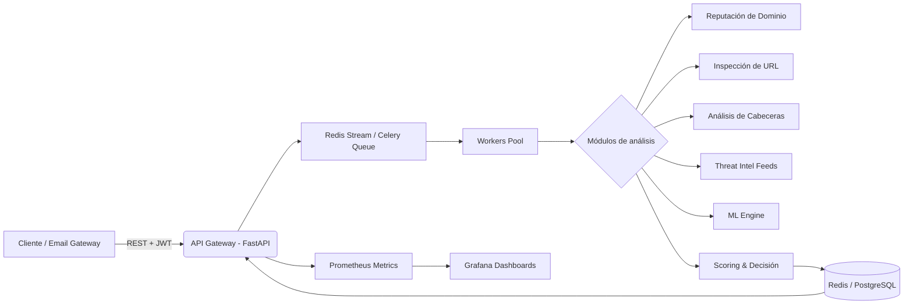

# 🛡️ PhishGuard Enterprise — Plataforma de Detección de Phishing en Tiempo Real


**Desarrollado por ThreatStalker**

---

PhishGuard Enterprise es una plataforma de detección de phishing de alto rendimiento diseñada para integrarse en SOCs, gateways de correo y entornos corporativos.  
Analiza dominios, URLs, cabeceras y cuerpos de correo electrónico mediante **múltiples motores de inteligencia**, procesamiento asíncrono y fuentes de threat intelligence, entregando un scoring preciso en milisegundos. Escala horizontalmente sobre **Kubernetes**, expone métricas **Prometheus** y se administra a través de dashboards **Grafana**.

---

## 📘 Índice

- [Características principales](#-características-principales)
- [Arquitectura de alto nivel](#-arquitectura-de-alto-nivel)
- [Requisitos](#-requisitos)
- [Inicio rápido](#-inicio-rápido)
- [Configuración](#-configuración)
- [API REST](#-api-rest)
- [Despliegue en Kubernetes](#-despliegue-en-kubernetes)
- [Observabilidad](#-observabilidad)
- [Seguridad](#-seguridad)
- [CI/CD](#-cicd)
- [Estructura del proyecto](#-estructura-del-proyecto)
- [Contribuciones](#-contribuciones)
- [Licencia](#-licencia)
- [Contacto](#-contacto)

---

## 🚀 Características principales

- **🔍 Análisis de dominios y URLs**  
  Reputación en tiempo real mediante consultas WHOIS, DNS, registros SSL/TLS, honeypots y listas negras (RBL, SURBL).

- **📧 Inspección profunda de correos electrónicos**  
  Extracción y análisis de cabeceras (SPF, DKIM, DMARC, Received), cuerpo, adjuntos y enlaces embebidos.

- **🧠 Módulos de inteligencia pluggables**  
  Integración nativa con *VirusTotal*, *AbuseIPDB*, *AlienVault OTX*, *MISP* y modelos de machine learning personalizados.

- **⚡ Procesamiento asíncrono de alto rendimiento**  
  Workers basados en **Celery** con **Redis** como broker y backend de resultados. Escalado bajo demanda.

- **🔐 Autenticación y autorización robusta**  
  Tokens JWT con scopes, API keys, rate limiting y auditoría completa de accesos.

- **📊 Observabilidad empresarial**  
  Métricas exportadas en formato Prometheus, dashboards preconfigurados en Grafana, logging estructurado (JSON) y trazabilidad con OpenTelemetry.

- **☸️ Cloud‑native y portable**  
  Imágenes Docker multi‑arquitectura, manifiestos Kubernetes listos para producción, Helm chart opcional, soporte para *Docker Compose*.

- **🔄 CI/CD automatizado**  
  GitHub Actions para build, tests unitarios/integración, análisis de seguridad de imágenes (Trivy) y despliegue progresivo.

---

## 🏗️ Arquitectura de alto nivel



1. **API (FastAPI + Uvicorn)** recibe solicitudes autenticadas y las encola en Redis.
2. **Workers Celery** consumen las tareas, ejecutan los módulos de análisis en paralelo y consolidan un score de riesgo.
3. Los resultados se almacenan en Redis (caché) y opcionalmente en PostgreSQL para auditoría histórica.
4. Las métricas de rendimiento, latencia y detecciones se exponen en `/metrics` y son consumidas por Prometheus.
5. Dashboards de Grafana permiten visualizar KPIs en tiempo real y configurar alertas.

---

## 📋 Requisitos

- **Docker** 20.10+ y **Docker Compose** v2 (ejecución local)
- **Kubernetes** 1.25+ (despliegue productivo)
- **Python** 3.11+ (solo para desarrollo)
- **Redis** 6+ (cache y broker)
- **PostgreSQL** 14+ (opcional, para persistencia histórica)

---

## ⚡ Inicio rápido

```bash
# Clonar el repositorio
git clone https://github.com/CyberZenithAI/phishguard-enterprise-phishing-detection-platform.git
cd phishguard-enterprise-phishing-detection-platform

# Configurar variables de entorno (copiar plantilla)
cp .env.example .env
# Editar .env con claves de APIs externas y secretos

# Construir y levantar todos los servicios
docker-compose up -d --build
```

La API se expone en `http://localhost:8000`.  
Documentación interactiva OpenAPI:  
- Swagger UI: `http://localhost:8000/docs`  
- ReDoc: `http://localhost:8000/redoc`

---

## 🔧 Configuración

Toda la configuración se gestiona mediante variables de entorno. Las principales son:

| Variable                | Descripción                                | Valor por defecto        |
|-------------------------|--------------------------------------------|---------------------------|
| `PHISHGUARD_ENV`        | Entorno (`development`, `production`)      | `production`              |
| `SECRET_KEY`            | Clave para firma de JWT                    | *obligatorio*             |
| `REDIS_URL`             | URI de conexión Redis                      | `redis://redis:6379/0`    |
| `DATABASE_URL`          | URI de PostgreSQL (opcional)               | `postgresql://...`        |
| `VIRUSTOTAL_API_KEY`    | API Key de VirusTotal                      | (vacío)                   |
| `ABUSEIPDB_API_KEY`     | API Key de AbuseIPDB                       | (vacío)                   |
| `OTX_API_KEY`           | API Key de AlienVault OTX                  | (vacío)                   |
| `MISP_URL` / `MISP_KEY` | Conexión a instancia MISP                  | (vacío)                   |
| `RATE_LIMIT`            | Solicitudes/minuto por IP/API key          | `100`                     |
| `LOG_LEVEL`             | Nivel de logs (INFO, DEBUG, WARNING)       | `INFO`                    |

Puedes extender los módulos de inteligencia implementando la interfaz `ThreatIntelligenceProvider` y registrándolos en el archivo de configuración `app/core/intel_providers.py`.

---

## 🌐 API REST

A continuación se resumen los endpoints principales. La especificación completa está disponible en `/docs`.

### Autenticación

| Método | Ruta              | Descripción                     |
|--------|-------------------|---------------------------------|
| POST   | `/auth/token`     | Obtener JWT (username/password) |
| POST   | `/auth/api-key`   | Generar API Key                 |

### Análisis de Phishing

| Método | Ruta                       | Descripción                                                       |
|--------|----------------------------|-------------------------------------------------------------------|
| POST   | `/analyze/domain`          | Analizar un dominio o URL                                         |
| POST   | `/analyze/email`           | Analizar un correo completo (RAW, EML o campos JSON)              |
| GET    | `/results/{task_id}`       | Consultar estado y resultado de una tarea asíncrona               |

### Administración

| Método | Ruta                | Descripción                         |
|--------|---------------------|-------------------------------------|
| GET    | `/health`           | Health check básico                 |
| GET    | `/metrics`          | Métricas Prometheus                 |
| GET    | `/admin/stats`      | Estadísticas globales (admin)       |

**Ejemplo de solicitud de análisis de URL:**

```bash
curl -X POST "http://localhost:8000/analyze/domain" \
  -H "Authorization: Bearer $TOKEN" \
  -H "Content-Type: application/json" \
  -d '{"url": "https://sospechoso-ejemplo.com/login"}'
```

Respuesta (resumen):

```json
{
  "task_id": "c0a80121-7ac0-4b1e-bc5e-12ab34cd5678",
  "status": "processing",
  "message": "Analysis queued"
}
```

Consulta del resultado:

```bash
curl "http://localhost:8000/results/c0a80121-7ac0-4b1e-bc5e-12ab34cd5678" \
  -H "Authorization: Bearer $TOKEN"
```

---

## ☸️ Despliegue en Kubernetes

El directorio `k8s/` contiene todos los manifiestos necesarios para un despliegue productivo con separación de componentes:

- **api-deployment.yaml** + **api-service.yaml** – API Gateway escalable (HPA incluido)
- **worker-deployment.yaml** – Workers Celery con escalado basado en profundidad de cola
- **redis-statefulset.yaml** – Redis con persistencia (RDB/AOF)
- **postgres-statefulset.yaml** (opcional)
- **monitoring/** – ServiceMonitor para Prometheus Operator
- **security/** – NetworkPolicies, PodSecurityPolicy y RBAC

```bash
kubectl apply -f k8s/
kubectl apply -f monitoring/
kubectl apply -f security/
```

Verifica el estado:

```bash
kubectl get pods -n phishguard
kubectl get svc -n phishguard
```

---

## 📈 Observabilidad

- **Prometheus** recopila métricas de cada pod (contador de análisis, latencia, errores, uso de Redis, etc.) a través de anotaciones automáticas.
- **Grafana** se aprovisiona con dashboards JSON en `monitoring/dashboards/` que muestran:
  - Volumen de detecciones por minuto
  - Distribución de scores
  - Rendimiento de workers
  - Estado de los integradores de threat intelligence
- Los logs se emiten en formato JSON estructurado, listos para ser ingeridos por ELK, Loki o CloudWatch.

---

## 🔒 Seguridad

PhishGuard Enterprise sigue prácticas de seguridad *defense-in-depth*:

- **Autenticación y autorización**: JWT con rotación, API Keys con scopes configurables, y middleware de rate limiting.
- **Comunicaciones**: TLS en todos los endpoints expuestos (configurable con Ingress y cert-manager en Kubernetes).
- **Secretos**: gestionados exclusivamente mediante variables de entorno, nunca en imágenes. En Kubernetes se recomienda usar Sealed Secrets o Vault.
- **Imágenes de contenedor**: construidas sin privilegios de root, escaneadas en el pipeline CI con Trivy, y basadas en imágenes minimalistas `python:3.11-slim`.
- **Aislamiento**: microservicios separados, comunicación interna solo a través de servicios Kubernetes, NetworkPolicies restrictivas y contexto de seguridad definido.
- **Auditoría**: todas las solicitudes a la API y operaciones críticas se registran con trazabilidad completa.

---

## 🔄 CI/CD

El pipeline de integración y despliegue continuo está implementado con **GitHub Actions** y cubre:

1. **Linting y pruebas estáticas** (Ruff, mypy, bandit)
2. **Tests unitarios e integración** con pytest (cobertura >85%)
3. **Construcción y escaneo de imágenes Docker** (Trivy)
4. **Push a registro** (Docker Hub / GHCR)
5. **Despliegue automático** a staging (y, con aprobación manual, a producción)

El archivo de workflow se encuentra en `.github/workflows/ci-cd.yml` y es fácilmente adaptable a GitLab CI o Jenkins.

---

## 📂 Estructura del proyecto

```
phishguard-enterprise/
├── app/
│   ├── api/                # Routers y dependencias FastAPI
│   ├── core/               # Configuración, seguridad, intel providers
│   ├── models/             # Modelos Pydantic y SQLAlchemy
│   ├── tasks/              # Definición de tareas Celery
│   ├── analysis/           # Módulos de análisis (dominio, email, URL)
│   ├── worker/             # Entrada del worker Celery
│   ├── monitoring/         # Instrumentación Prometheus
│   └── main.py             # Punto de entrada de la API
├── k8s/                    # Manifiestos Kubernetes
├── monitoring/             # Configuración Prometheus, reglas, dashboards
├── security/               # Políticas de red y RBAC
├── tests/                  # Tests unitarios, integración, contract
├── scripts/                # Utilidades de despliegue y migraciones
├── docker-compose.yml
├── Dockerfile
├── Dockerfile.worker
├── requirements.txt
├── .env.example
└── README.md
```

---

## 🤝 Contribuciones

¡Las contribuciones son bienvenidas! Por favor, revisa la [guía de contribución](CONTRIBUTING.md) y el código de conducta.  
Todas las PRs deben pasar los checks automáticos (lint, tests, escaneo) y ser revisadas por al menos un mantenedor.

---

## 📄 Licencia

Este proyecto está licenciado bajo **Apache License 2.0**.  
Consulta el archivo [LICENSE](LICENSE) para más detalles.

---

## 📬 Contacto

- **Autor**: ThreatStalker  
- **GitHub**: [CyberZenithAI](https://github.com/CyberZenithAI)  
- **Soporte**: abre un issue en el repositorio o contacta a través de los canales oficiales de ThreatStalker.

---

*PhishGuard Enterprise – Defensa inteligente contra phishing en la era de las amenazas avanzadas.*  
*Desarrollado con precisión, implementado con rigor.*
